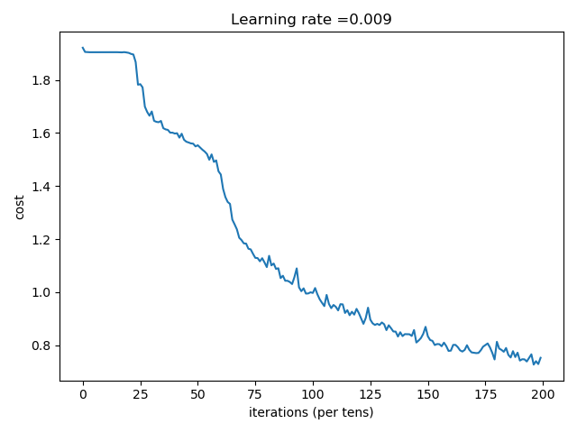

  
#### ConvNet implementation from Deeplearning.ai  
cnn_util.py contains function for the non-tensorflow forward prop implementation.  
There is no runner provided for this one.  

To run the tensorflow implementation of CNN:  
python tf_cc_util.py  

1. This will display an example of an image from the training set.  
2. Train the CNN  
3. Compute Train/Test Accuracy  
4. Plot Learning Curve  

  
